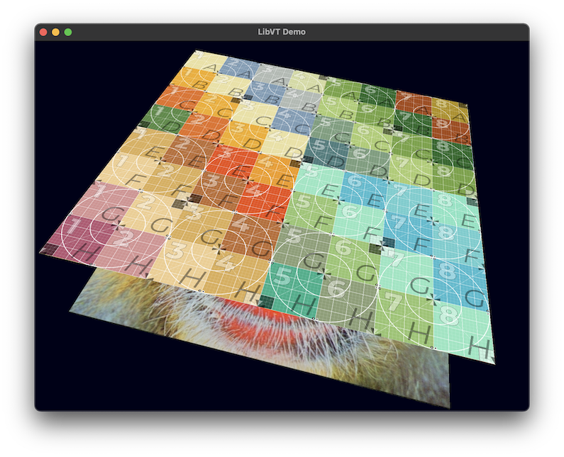

# Hello Virtual Texturing



A complete yet minimal implementation of virtual texturing that is cross-platform and provides a reference sample app.

Virtual texturing is a technique for viewing textures which are larger than can fit in memory.  These mega textures are mipmapped and each mipmap level is tiled.  Each tile (also called a page) is stored on disk as a separate image file.  Tiles are then loaded on-demand based on the current view.  Rendering tiles is done in the main thread, with loading and decompressing of pages done asynchronously on one or two background threads, leading to smooth panning and zooming of these big textures.

This work is an OpenGLES-specific and modernized fork of [LibVT](https://github.com/core-code/LibVT?tab=readme-ov-file#readme) plus a cross-platform sample app.  Special thanks to [Julian Mayer](https://github.com/core-code) for his original implementation and thorough documentation.

Goals:

- Provide a minimal example of virtual texturing to help in learning the algorithm and to serve as a building block for other projects.

- Enable cross platform native builds on Mac, Windows, and Linux, and a future WebGL build via Emscripten.  To this end, C++ and OpenGLES were chosen from the start.

- Supply a reference sample that demonstrates the LibVT calls necessary to load and render a virtual texture, while utilizing SDL for cross-platform windowing and event handling.

Also, see [below](https://github.com/erik-larsen/hello-vt/edit/main/README.md#related-projects) for a comparison to [shlomnissan's virtual-textures](https://github.com/shlomnissan/virtual-textures), a similar project but written in modern C++ and OpenGL 4.1.

## Sample

The sample shows rendering of a test virtual texture to a simple quad.  A traditional static texture is also drawn underneath to show how to mix regular rendering with LibVT rendering.

Controls:
```
Zoom:     Mouse wheel
Pan:      Arrow keys
Orbit:    Left mouse button drag
Reset:    'R' key
Quit:     'ESC' key
```

## Building and Running

Install dependencies for your platform.

### Mac

Install [Homebrew](https://brew.sh/) if you don't have it, then SDL2 and SDL2_image:
```bash
brew install SDL2
brew install SDL2_image
```

Build and run:
```bash
git clone https://github.com/erik-larsen/hello-vt.git
cd hello-vt
make
cd Sample
./bin-mac-x86_64/hello-vt
```
or
```bash
./bin-mac-arm64/hello-vt
```
depending on your Mac.

### Windows

Setup clang compilation on Windows.  First, install MSYS from cmd.exe:
```bash
winget install MSYS2.MSYS2
setx PATH "%PATH%C:\msys64\clang64\bin"
```
Then run from MSYS2 CLANG64 shell:
```bash
pacman -Syu
pacman -S git
pacman -S base-devel mingw-w64-clang-x86_64-toolchain
pacman -S mingw-w64-clang-x86_64-SDL2
pacman -S mingw-w64-clang-x86_64-SDL2_image
```

Then to build and run (also from MSYS2 CLANG64 shell):
```bash
git clone https://github.com/erik-larsen/hello-vt.git
cd hello-vt
make
cd Sample
./bin-win-x86_64/hello-vt.exe
```

### Linux

This was tested on Debian 11.3 and Ubuntu 24.04:

```bash
sudo apt update
sudo apt install git
sudo apt install build-essential clang
sudo apt install libsdl2-dev libsdl2-image-dev
```

Then to build and run:
```bash
git clone https://github.com/erik-larsen/hello-vt.git
cd hello-vt
make
cd Sample
./bin-linux-x86_64/hello-vt
```


## Implementation

Many virtual texturing implementations have been available in C, C++ and JS, using OpenGL, Direct3D, and WebGL.  However, for the purposes of this project they are either not well-documented, not minimal, not cross-platform, or not straightforward to build due to age (most date from 2010 or earlier).  Of note, [OpenSeaDragon](https://openseadragon.github.io/) is an excellent implementation of virtual texturing but is not a good fit for this project because it is not C++ and not minimal.

Instead, LibVT was chosen for its C++ implementation, OpenGLES code path, and decent documentation.  Fixes were made to LibVT to get it running again 15 years later, and to remove code not on the OpenGLES code path.  Further, an SDL-based sample app with a pre-processed test image is provided to demonstrate LibVT. (Note: At one time LibVT provided its own [pre-built sample](https://bintray.com/artifact/download/corecode/LibVT/libvt_demo_binaries_win32_mac.zip), but the link is dead and not saved on archive.org).

For an overview of LibVT's multithreading implementation, see the [LibVT readme](libvt/README.md).


## Work status

### OpenGLES2/WebGL 1 target

- [x] Code minimized to OpenGLES2 / WebGL1
- [x] Synchronous framebuffer readback
- [x] Decompress png/jpg files only, using stb
- [x] No texture compression
- [x] Multithreading (main, loader, and decompression threads)
- [x] PNG sample
- [ ] JPG sample
- [ ] Emscripten build, with tiles from server
- [ ] Visualize virtual and physical textures for debugging
- [ ] Auto configure LibVT based on input image

### OpenGLES3/WebGL 2 target

- [ ] Add OpenGLES3 / WebGL2 code path
- [ ] Async + double-buffered PBO readback
- [ ] ETC2 GPU texture compression (guaranteed in WebGL2)
- [ ] Anisotropic texture filtering (via GL_EXT_texture_filter_anisotropic)
- [ ] Maybe use faster, browser-standard decompression libs, libjpeg-turbo and libpng
- [ ] Maybe handle more image tile formats (any requests?)

## Authors

- Erik Larsen (LibVT fork and sample app)
- Julian Mayer (original LibVT author)

## Related Projects

Another concise, cross-platform virtual texturing project is [shlomnissan / virtual-textures](https://github.com/shlomnissan/virtual-textures).  Here are the pros and cons of each project:

### hello-vt / libvt
Pros:
- Targets OpenGLES2 — runs on mobile, older hardware, WebGL (future goal)
- C API library (LibVT prefix) — stable ABI, easy FFI, embeddable in any language
- Clean separation between VT system and windowing/rendering — drop into existing projects
- Makefile build — explicit, transparent, easy to translate to other build systems
- Production-grade threading: dedicated persistent loader and decompressor threads with condition variables
- Three-stage pipeline (disk I/O → decompress → GPU upload) allows overlapping work

Cons:
- Older C++ style — more verbose, harder to read for those used to modern C++
- Manual dependency management via system packages (brew, apt, pacman)
- Inherited complexity from 2010-era LibVT codebase
- Less readable as a learning resource

### virtual-textures
Pros:
- Modern C++23 — clean, expressive, idiomatic code
- CMake + vcpkg — declarative dependencies, reproducible builds, single command setup
- Excellent clarity — easy to follow end-to-end - better for learning
- Modern OpenGL 4.1 with explicit mip calculation (dFdx/dFdy, textureGrad) - better if targeting desktop
- Has async loading via std::jthread
- Includes debug overlay (minimap showing page residency and feedback) - better for learning

Cons:
- Less modular: VT logic coupled to GLFW, ImGui, app-specific classes
- Would require refactoring to extract and embed elsewhere
- Spawns new thread per load request (overhead)
- Requires OpenGL 4.1 — won't run on mobile/WebGL
